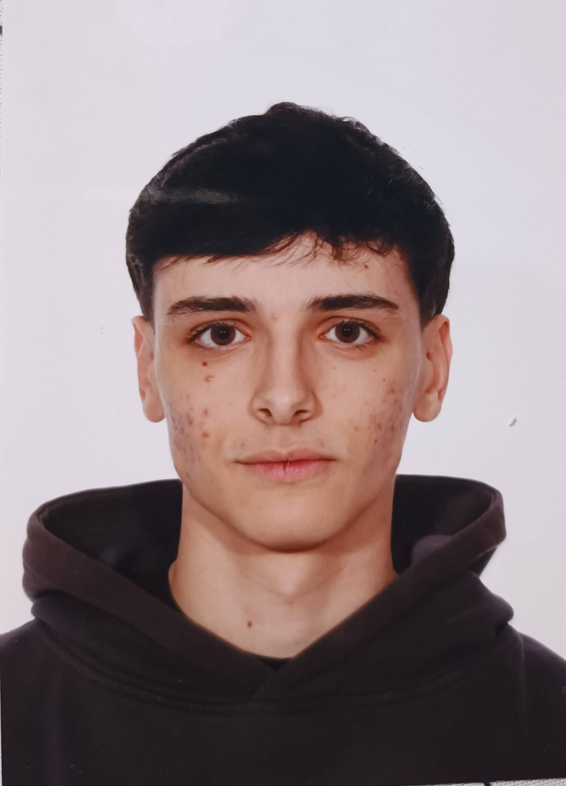

# Álvaro García Velasco

*Graduado en Inteligencia Artificial*

[Proyectos](#projects) | [Sobre mí](#about) | [Blog](/blog) | [Contacto](#contact)

---

## Proyectos destacados {#projects}

### Chatbot RAG Empresarial
Asistente de RRHH con recuperación de documentos internos.  
[Ver código](https://github.com/alvaroG-IA/chatbot-rag)

### IA para Ciberseguridad
Clasificación de tráfico de red malicioso con autoencoders.  
[Ver código](https://github.com/alvaroG-IA/cybersecurity-ml)

### Detector y Clasificador de jeroglíficos
Sistema encargado de detectar y clasificar jeroglíficos basado en la arquitectura `CycleGAN`.  
[Ver código](https://github.com/alvaroG-IA/clf)

---

## Sobre mí {#about}

Hola! Mi nombre es Álvaro García Velasco. Actualmente soy estudiante del grado en Inteligencia Artificial en la Universidad Rey Juan Carlos. Me considero un apasionado de la tecnología y del mundo de la IA. Mis principales intereses son los LLM y la integración de IA en sistemas reales.

---

## Contacto {#contact}

- **Email:** alvarogarciavelasco1212@gmail.com  
- **GitHub:** [alvaroG-IA](https://github.com/alvaroG-IA)  
- **LinkedIn:** [LinkedIn](https://www.linkedin.com/in/%C3%A1lvaro-garc%C3%ADa-velasco-2a301031a)
